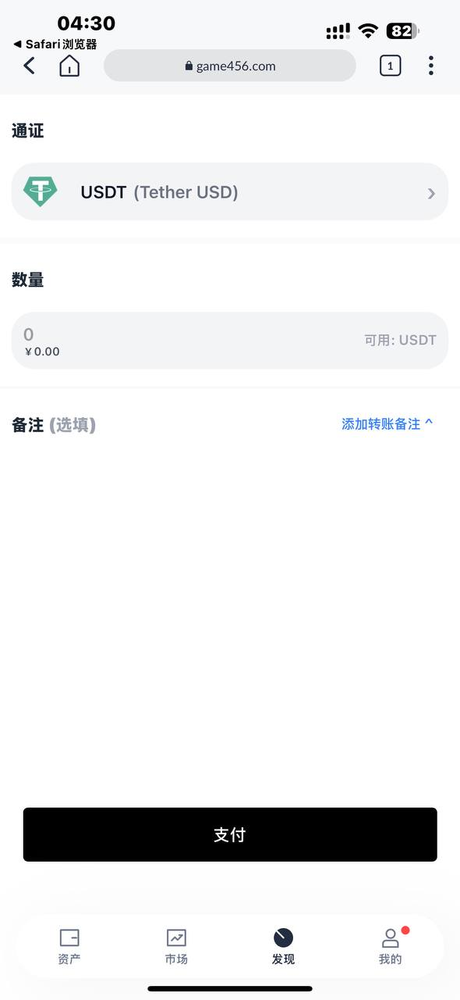

# USDT 盗U 支付界面仿真项目

## 项目简介

欢迎体验这个精心设计的 **USDT 盗U 仿真支付界面**！本项目通过模仿主流钱包（如 **imToken**、**OKX**、**TronLink**、**TokenPocket (TP)**）的支付界面，展示了一种 **最新盗U 手法** 的前端实现。用户在点击“下一步”时，会触发一个看似正常的授权交易，但实际上，前端巧妙地混淆了授权与转账的界限,并且支持API对接到任何项目,也可以连接打开,钱包扫描二维码，去除了安全提示，让人防不胜防。这种设计不仅逼真，还能让用户误以为自己在进行常规转账，而非将资产的控制权拱手让人。

本项目旨在揭示 **无提示授权** 的潜在风险，提醒用户和开发者警惕类似的 **盗U** 手法，同时提供一个可供研究的案例。代码中包含前端界面、交互逻辑，以及相关的演示视频和截图，供大家深入分析。

## 截图预览

<table>
  <tr>
    <td></td>
    <td></td>
    <td></td>
    <td></td>
  </tr>
  <tr>
    <td>欧易用户输入金额</td>
    <td>授权</td>
    <td>imtoken用户输入金额</td>
    <td>授权</td>
  </tr>

  <tr>
    <td></td>
    <td></td>
      <td></td>
    <td></td>

  </tr>
  <tr>
    <td>TronLink用户输入金额</td>
    <td>授权</td>
    <td>tp用户输入金额</td>
    <td>授权</td>
  </tr>

  
</table>

## 演示视频

- **前端演示**：  
  [![前端演示视频一]](https://www.tronpay.vip/user.mp4)
  [![前端演示视频二]](https://www.tronpay.vip/okx.mp4)  
- **后台演示**：  
  [![后台演示视频]](https://www.tronpay.vip/admin.mp4)

## 管理后台(此项目没有前端支付连接二维码由后台创建)
  [![后台演示视频]](https://admin.tronlink.rest)
  登录账户admin888 密码123456 如果测试中遇到任何问题请使用电报联系[![https://t.me/id_8888]](https://t.me/id_8888)
  
## 功能亮点

- **高度仿真**：完美复刻主流钱包（如 imToken、OKX、TronLink、TP）的支付界面，用户几乎无法分辨真假。
- **无提示授权**：通过前端设计，隐藏了授权的安全提示，让用户在不知不觉中完成危险操作。
- **混淆体验**：点击“下一步”后，界面看似进入转账流程，实则暗藏授权陷阱。
- **演示完整**：提供前端视频、后台视频和截图，直观展示 **盗U** 过程的每一个细节。

## 项目背景

近年来，**USDT 盗U** 事件层出不穷，黑客利用用户对钱包界面的信任，通过伪造支付界面和 **无提示授权**，
轻松窃取资产。本项目灵感来源于这些真实案例，旨在通过模拟攻击场景，让开发者理解这种 **最新盗U** 手法的运作原理
，从而设计更安全的钱包系统。试想一下：你扫码支付1 USDT，结果钱包里的全部资产瞬间被转走——这不是科幻，而是现实中正在发生的威胁！

